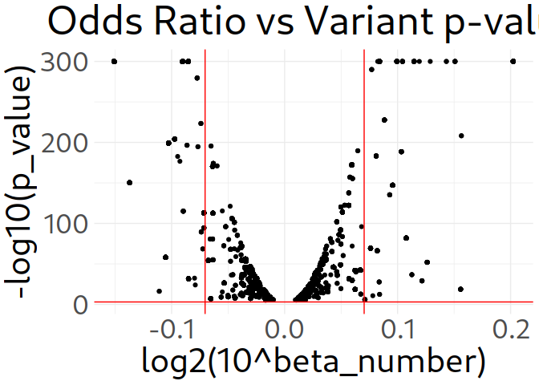
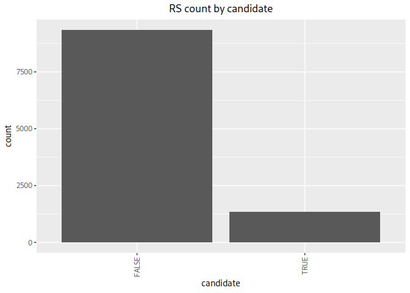

<!-- README.md is generated from README.Rmd. Please edit that file -->

# DRAGGER

<!-- badges: start -->

[](https://github.com/AEstebanMar/DRAGGER/actions/workflows/R-CMD-check.yaml)
<!-- badges: end -->

DRAGGER provides a toolkit for drug repositioning based on variant and
gene-expression data. It includes a wrapper for a basic workflow, but a
custom run can be set up with ease.

## Installation

You can install the development version of DRAGGER from
[GitHub](https://github.com/) with:

``` r
# install.packages("devtools")
devtools::install_github("AEstebanMar/DRAGGER")
```

## Example

DRAGGER includes a demo dataset to showcase its main use case.

``` r
library(DRAGGER)
head(GWAS_demo)
#>   variant_id pvalue beta_number
#> 1  rs2710888  2e-57      0.0115
#> 2  rs3934834  2e-29      0.0097
#> 3   rs182532  1e-18     -0.0163
#> 4 rs17160669  1e-28      0.0100
#> 5  rs9660106  2e-12      0.0044
#> 6   rs425277 2e-166      0.0191
head(GTEx)
#>                 Tissue           gene_id     gene_name strand
#> 1 Adipose_Subcutaneous ENSG00000227232.5        WASH7P      -
#> 2 Adipose_Subcutaneous ENSG00000268903.1 RP11-34P13.15      -
#> 3 Adipose_Subcutaneous ENSG00000269981.1 RP11-34P13.16      -
#> 4 Adipose_Subcutaneous ENSG00000241860.6 RP11-34P13.13      -
#> 5 Adipose_Subcutaneous ENSG00000279457.4 RP11-34P13.18      -
#> 6 Adipose_Subcutaneous ENSG00000228463.9    AP006222.2      -
#>   variant_information tss_distance rs_id_dbSNP151_GRCh38p7 pval_nominal
#> 1  chr1_64764_C_T_b38        35211             rs769952832  1.01661e-08
#> 2 chr1_103147_C_T_b38       -32748             rs866355763  3.47332e-04
#> 3 chr1_108826_G_C_b38       -29139              rs62642117  1.19525e-04
#> 4  chr1_14677_G_A_b38      -159185             rs201327123  7.91948e-08
#> 5 chr1_599167_G_A_b38       403756             rs188376087  1.53694e-07
#> 6 chr1_280550_G_A_b38       -16952            rs1206875823  2.72051e-20
#>       slope
#> 1  0.586346
#> 2 -0.612097
#> 3  0.431229
#> 4  0.700658
#> 5 -0.687794
#> 6 -1.822030
head(DGIdb)
#>   gene_name entrez_id interaction_claim_source interaction_types
#> 1      CDK7      1022            CancerCommons         inhibitor
#> 2       VDR      7421                      DTC           Missing
#> 3     GPR55      9290                      DTC           Missing
#> 4     NR1H4      9971                      DTC           Missing
#> 5     FGFR2      2263                  JAX-CKB           Missing
#> 6      APOE       348                      NCI           Missing
#>     drug_claim_name     drug_concept_id interaction_group_score    PMIDs
#> 1           SNS-032 chembl:CHEMBL296468                    0.82  Missing
#> 2        NIFEKALANT chembl:CHEMBL360861                    0.14  Missing
#> 3         BISACODYL    chembl:CHEMBL942                    0.94  Missing
#> 4 PENTACHLOROPHENOL  chembl:CHEMBL75967                    0.07  Missing
#> 5            AZ6089             Missing                      NA 22869148
#> 6        PREDNISONE    chembl:CHEMBL635                    0.23  3185288
```

DRAGGER includes a wrapper function, aptly named DRAGGER, which executes
the basic workflow. Workflow is described in detail in vignettes, along
with customisation options.

``` r
library(DRAGGER)
demo <- DRAGGER(GWAS_demo, GTEx, DGIdb)
#> 
#> 
#> Parsing variant data
#> Parsing data frame as GWAS data
#> Matching p_val_variant column...
#> Match found. Parsing...
#> Matching beta_value column...
#> No matches found
#> Matching rs_id column...
#> Match found. Parsing...
#> Matching gene_symbol column...
#> No matches found
#> Matching drug_name column...
#> No matches found
#> Sorting input by statistical significance
#> 
#> 
#> Parsing expression data
#> Parsing data frame as GTEx data
#> Matching p_val_nominal column...
#> Match found. Parsing...
#> Matching rs_id column...
#> Match found. Parsing...
#> Matching gene_symbol column...
#> Match found. Parsing...
#> Matching drug_name column...
#> No matches found
#> 
#> 
#> Parsing drug-gene data
#> Parsing data frame as DGIdb data
#> Matching rs_id column...
#> No matches found
#> Matching gene_symbol column...
#> Match found. Parsing...
#> Matching drug_name column...
#> Match found. Parsing...
#> Merging genes and variants
#> Merging with drug database
#> Predicting beneficial drug effect
#> Producing list of candidates for repositioning
head(demo)
#>   gene_symbol      rs_id p_val_variant beta_number               Tissue
#> 1        AAK1  rs3899666         2e-28      0.0076 Esophagus_Muscularis
#> 2        AAK1  rs3899666         2e-28      0.0076 Esophagus_Muscularis
#> 3        AAK1  rs3899666         2e-28      0.0076 Esophagus_Muscularis
#> 4        AAK1 rs12987661         9e-12     -0.0078        Kidney_Cortex
#> 5        AAK1 rs12987661         9e-12     -0.0078        Kidney_Cortex
#> 6        AAK1 rs12987661         9e-12     -0.0078        Kidney_Cortex
#>              gene_id strand   variant_information tss_distance p_val_nominal
#> 1 ENSG00000115977.18      - chr2_69640739_C_T_b38       -33610   1.00569e-07
#> 2 ENSG00000115977.18      - chr2_69640739_C_T_b38       -33610   1.00569e-07
#> 3 ENSG00000115977.18      - chr2_69640739_C_T_b38       -33610   1.00569e-07
#> 4 ENSG00000115977.18      - chr2_69586326_T_C_b38       -88023   1.00882e-04
#> 5 ENSG00000115977.18      - chr2_69586326_T_C_b38       -88023   1.00882e-04
#> 6 ENSG00000115977.18      - chr2_69586326_T_C_b38       -88023   1.00882e-04
#>       slope entrez_id interaction_claim_source interaction_types drug_name
#> 1 -0.195734     22848      GuideToPharmacology         inhibitor 223366123
#> 2 -0.195734     22848                      TTD           Missing    LX9211
#> 3 -0.195734     22848      GuideToPharmacology         inhibitor 384403682
#> 4 -0.495702     22848      GuideToPharmacology         inhibitor 223366123
#> 5 -0.495702     22848                      TTD           Missing    LX9211
#> 6 -0.495702     22848      GuideToPharmacology         inhibitor 384403682
#>        drug_concept_id interaction_group_score   PMIDs prediction candidate
#> 1 chembl:CHEMBL2105759                    7.96 Missing  activator     FALSE
#> 2              Missing                      NA Missing  activator     FALSE
#> 3              Missing                      NA Missing  activator     FALSE
#> 4 chembl:CHEMBL2105759                    7.96 Missing  inhibitor      TRUE
#> 5              Missing                      NA Missing  inhibitor     FALSE
#> 6              Missing                      NA Missing  inhibitor      TRUE
```

Here is a preview of the type of plots included in DRAGGER, also heavily
customisable.

``` r
library(DRAGGER)
demo <- suppressMessages(DRAGGER(GWAS_demo, GTEx, DGIdb))
plot_volcano(demo)
```



``` r
barplot_by_groups(demo, "rs_id", "candidate")
```


A small expasion of base-R chisq test is also included, and can provide
insight into DRAGGER results. The following example compares the number
of RS with a valid candidate by tissue, specifically brain vs stomach.

``` r
library(DRAGGER)
demo <- suppressMessages(DRAGGER(GWAS_demo, GTEx, DGIdb))
test_chi2(demo, "Tissue", "brain", "stomach",
      "candidate", TRUE, FALSE)
#> Warning in chisq.test(chisq_table): Chi-squared approximation may be incorrect
#> $table
#>                candidate_TRUE candidate_FALSE
#> Tissue_brain              309               0
#> Tissue_stomach           1548              17
#> 
#> $chi2
#>         X2   p.value   Cramer_V
#> 1 2.286645 0.1304917 0.03493129
```
